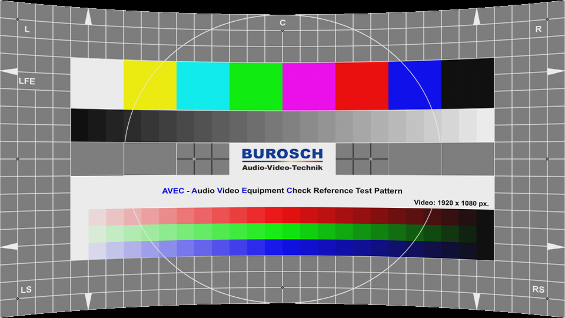
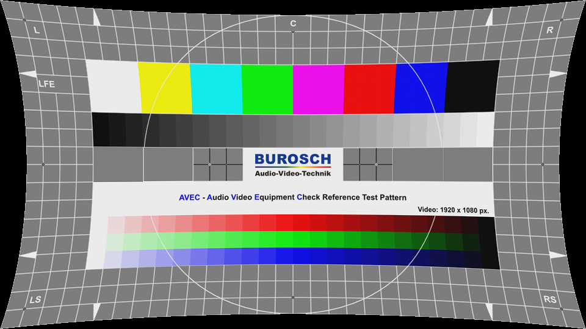
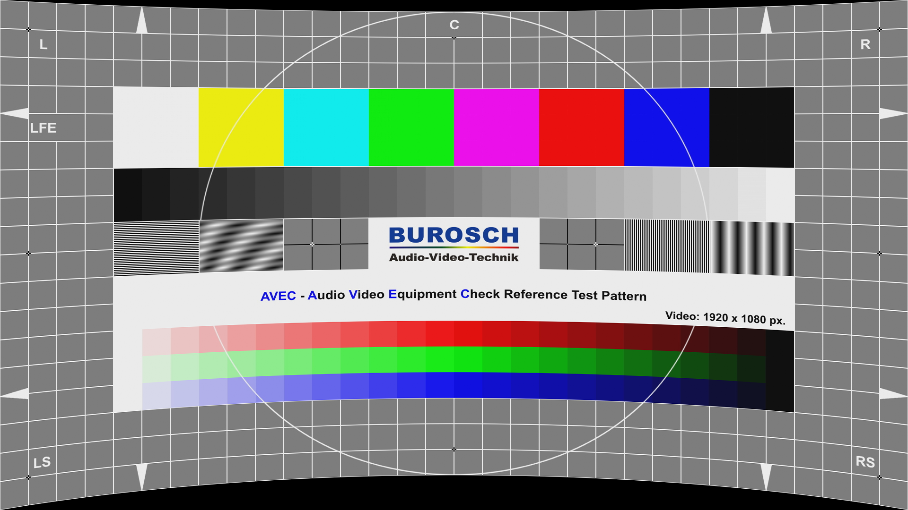
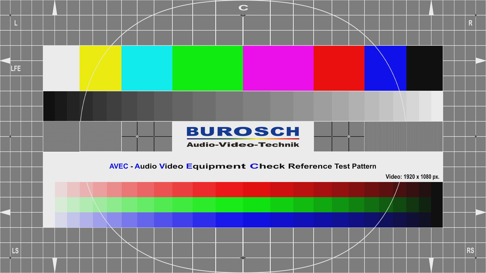

# Warping for projection on a curved screen
Projecting an image on a curved screen with a projector introduces several geometric distortions, because most lenses are engineered to be used on plane screens. These distortions can be compensated by software.

This repository contains a GLSL/HLSL shader for MPV and MPC-HC. The shader has several variables which control the geometry distortion which is then applied with high quality bicubic filtering. Lanczos3 was also evaluated, but gave no better results than bicubic and was discarded. The shader is best applied after scaling of the player/renderer. Tests revealed the best result in this case.

**Note: the GUI of both players will not be warped since it is overlayed after image processing.**

**Note 2: For MPV the target resolution has to be specified in the script, because there is no variable to get it from.**

## Example images
The shader supports the following distortions. All type of distorions can be combined. Please see the comments behind the variables inside the shader.

**Symmetrical curvature in both dimensions:**

**Asymmetrical curvature:**

**Bow distortion inside the curvature:**

**Trapezoid:**

**Linearity:**

